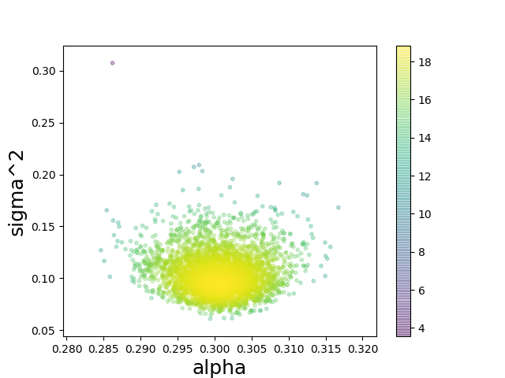

# Python interface of TMCMC

Module tmcmc implements the TMCMC (Transitional Markov-Chain Monte Carlo) algorithm.

We use the C implementation of the algorithm and the *ctypes wrapper* module for calling it from Python.
Since the function we are sampling from is also written in Python, we use *embedded Python* to call the
function from the C code and *numpy* to pass arguments between the two environments.

## TMCMC

The Python interface of TMCMC is defined as follows:

**def tmcmc(fitfun, dim=2, maxstages=20, popsize=1024, lowerbound=[-6,-6], upperbound=[6,6], id=0):**

Inputs:

- **fitfun**: python script name (without the .py extension) that implements the log-likelihood function.
The prototype is: fitfun(x, dim), where *x* is a vector of parameter values and *dim* the number of parameters.
- **dim**: number of parameters
- **maxstages**: maximum number of stages that can be performed by the TMCMC algorithm
- **popsize**: number of samples per stage
- **lowerbound**: lower bound for each parameter
- **upperbound**: uppoer bound for each parameter
- **id**: integer identifier for the specific *tmcmc()* call. The value is appended to the output files generated by the algorithm.

Outputs:

- The tmcmc function returns the log-evidence of the model.
- In addition, for each stage of the algorithm, the evaluation points and their log-likelihood are stored in text files
named as *curgen_db_xxx_yyy.txt*, where **xxx**: *id* of the *tmcmc()* call, and **yyy**: stage of the algorithm.

## Fitness function

The fitness function typically computes the model output and **returns** the log-likelihood of the data.

**def fitfun(theta, dim):**

- **theta**: parameters of the model
- **dim**: number of parameters

## Plotting

2D scatter plots of the samples stored in the output text files, colored according to their log-likelihood values,
can be produced by means of the **plot_gen()** function.

**def plot_gen(filename, dim=2, i=1, j=2, show=1, save=0):**

- **filename**: curgen_db_xxx_yyy.txt file
- **dim**: number of parameters
- **i**: i-th parameter
- **j**: j-th parameter
- **namei**: label for the i-th parameter
- **namej**: label for the j-th parameter
- **show**: depict the plot on the screen
- **save**: save the plot in a png file (filename.png)

## Example

### demo3.py

    # Import necessary modules
    import sys
    sys.path.append("../lib_python")
    from tmcmc import *
    from plot_gen import *

    logEv=tmcmc("fitfun3",dim=2,maxstages=20,popsize=4096,lowerbound=[-10,-10],upperbound=[10,10],id=3)
    print("logEv=",logEv[0])

    plot_gen('curgen_db_003_009.txt', dim=2, i=1, j=2, namei='alpha', namej='sigma^2', show=1, save=0)

### fitfun3.py

    # data-driven inference
    # underlying data model: y = ax + e, where
    # a=0.3 and e=N(0,sigma^2), sigma=0.1

    import numpy as np
    import math

    def fitfun3(theta, dim):

        a = theta[0]
        sigma = theta[1]

        data = np.loadtxt('data3.txt')
        N=data.shape[0];

        x = data[:,0]
        dy = data[:,1]

        y = a*x;

        SSE = np.sum((y-dy)\*\*2)
        sy=sigma;
        logn = -0.5*N*math.log(2*math.pi)-0.5*N*math.log(sy*sy)-0.5*SSE/(sy*sy)

        return logn

## Installation and testing

### Prerequisites

Make sure that the following required software has been installed.

* CGG compiler
* Python 2.7 (or higher)
* Python-devel package
    * `python2-config` or `python3-config` must be available
    * MacOS: automatically available if python has been installed with brew
* Python numpy package
    * MacOS: `pip install numpy`
* Python matplotlib package
    * MacOS: `pip install matplotlib`
* GNU GSL library
    * MacOS: `brew install gsl`
    * We also provide the option to download and use a local copy of the GSL library

### Installation steps

1\. Download from GitHub:

`git clone https://github.com/cselab/pi4u.git pi4u-tmcmc -b tmcmc`

If you do not have git, download *pi4u-tmcmc.zip* from here: [GitHub download link](https://github.com/cselab/pi4u/archive/tmcmc.zip)

2\. Go to pi4u-tmcmc/src and build the TMCMC library:

`cd pi4u-tmcmc/src; make`

`cd ..`  (*go back to the pi4u-tmcmc directory*)

### Testing - Running the demo

1\. Go to pi4u-tmcmc/demo_python and run demo3.py

`cd demo_python; python2 demo3.py`  

2\. The scatter plot of samples for our example should be as follows:

## Troubleshooting and additional options

### How to build the software using a local copy of the GSL library

1\. Go to pi4u-tmcmc/gsl and run build.sh:

`cd pi4u-tmcmc/gsl; ./build.sh`

`cd ..`  (*go back to the pi4u-tmcmc directory*)

2\. Go to pi4u-tmcmc/src and build the TMCMC library:

`cd gsl; ./build.sh`

`make mygsl=1`

### How to build the software using python3

1\. Go to pi4u-tmcmc/src and (re)-build the TMCMC library:

`make clean; make python3=1`

`cd ..`  (*go back to the pi4u-tmcmc directory*)

2\. Go to demo_python and run demo3.py using python3

`cd demo_python; python3 demo.py`
